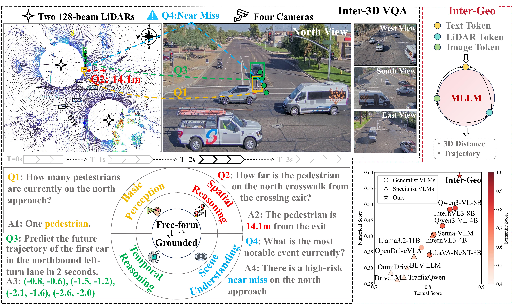

# Inter-3D VQA: A Roadside Multimodal Benchmark for 3D Spatiotemporally Grounded Visual Question Answering
[EMNLP 2026] The official codebase for the paper "Inter-3D VQA: A Roadside Multimodal Benchmark for 3D Spatiotemporally Grounded Visual Question Answering"



---

## 📢 Announcements
Stay up to date with the latest news, updates, and important notices regarding Inter-3D VQA:

- **`2026/08/05`**: The v0.1.0 dataset and benchmark code for our MLLM baseline Inter-Geo are released.
- **`2026/08/08`**: The benchmark code for open-source generalist VLMs is released. Currently supported open-source models are as follows: [LLaVA-NeXT](https://llava-vl.github.io/blog/2024-05-10-llava-next-stronger-llms/), [Llama3.2](https://github.com/meta-llama/llama-models/blob/main/models/llama3_2/MODEL_CARD.md), [Qwen3-VL](https://arxiv.org/abs/2511.21631), [InternVL3](https://arxiv.org/abs/2504.10479)
- **`2026/08/11`**: The benchmark code for specialized driving VLMs is released. Currently supported driving models are as follows: [Senna-VLM](https://arxiv.org/abs/2410.22313), [NuScenes-QA](https://arxiv.org/abs/2305.14836), [OmniDrive](https://arxiv.org/abs/2606.17536), [OpenDriveVLA](https://arxiv.org/abs/2503.23463), [DriveLM](https://arxiv.org/abs/2312.14150), [BEV-LLM](https://arxiv.org/abs/2507.19370)
- **`2026/08/13`**: The benchmark code for specialized roadside VLMs is released. Currently supported roadside models are as follows: [TraffiX-Qwen](https://arxiv.org/abs/2502.02449)
- **`2026/08/23`**: Paper has been accepted by EMNLP 2026 main conference 🎉.

## ✅ TODO
- [x] Release the Inter-3D VQA dataset
- [x] Release the Inter-Geo MLLM baseline
- [x] Release the benchmark code for open-source generalist VLMs
- [x] Release the benchmark code for specialized driving and roadside VLMs


## 📦 Data Download
The sensor data for Inter-3D VQA is available upon registration. Please complete the [**Data Request Form**](https://docs.google.com/forms/d/e/1FAIpQLSfd00G4eSLqWuqtdUOekNfyT9oihNA87RgCflvemejIhnJIug/viewform?usp=publish-editor) to receive the download link via email.

After downloading and decompressing the data, please organize the data to the following structure:
```
PROJECT_ROOT
├── data
│   │── 📂 rosbag2_2025_10_14-07_21_21
│   │   │── 📂 128_128b_sync
│   │   │   │── 📄 1760451628-250275702.bin # point cloud fused by two high resolution LiDAR
│   │   │   └   ...
│   │   │── 📂 ouster128b_sync
│   │   │   │── 📄 1760451628-250275702.bin # point cloud captured by the high-resolution LiDAR at the northwest corner of the intersection
│   │   │   └   ...
│   │   │── 📂 ouster128_sync
│   │   │── 📂 axis1_sync
│   │   │   │── 🖼️ 1760451681-076657049.jpg # image captured by the camera located south of the intersection.
│   │   │   └   ...
│   │   │── 📂 axis2_sync
│   │   │── 📂 axis3_sync
│   │   │── 📂 axis4_sync
│   │   │── 📂 calibration_txt
│   │   │   │── 📂 axis1__ouster128b
│   │   │   │   │── 📊 1760451681-076657049__1760451628-150432431_calibration.txt
│   │   │   │   └   ...
│   │   │   │── 📂 axis2__ouster128b
│   │   │   │── 📂 axis3__ouster128b
│   │   │   │── 📂 axis4__ouster128b
│   │── 📊 HSQJN_3.json # annotation information file
│   └   ...
├── LlamaFactory
├── utils
├── VLM
```


## 🏋️ Getting Started
### Requirements
The code has been tested in the following environment:
* Ubuntu 22.04 LTS
* PyTorch 2.11.0
* Python 3.11.15
* CUDA 13.0
* Other project dependencies:
```bash
pip install -r requirements.txt
```

### Dataset Preparation
For convenience, we provide [**pre-generated QA datasets**](https://www.dropbox.com/scl/fo/sm634m7809sxb3v67dk7f/AK1XEoLuCsmmXHvG---LQO4?rlkey=6rp0f4gqrpus2q8s8i1szjfo6&st=fzq7hh8i&dl=0) for both grounded and free-form formats. Then you can skip Steps 1 and 2.

1. Create metadata:
```bash
#  os128: high-resolution LiDAR data, os64: medium-resolution LiDAR data, rs16: low-resolution LiDAR data
python tools/create_sunlakes_data_v3.py --data_root ../data/  --sensor_type os128 
```
After preprocessing, merge `sunlakes_infos_train.pkl` and `sunlakes_infos_val.pkl` into `sunlakes_infos_trainval.pkl`

2. Generate QA datasets:
```bash
#  v5: Grounded QA
python3 utils/create_QA_v5.py --keyframe-fps 2.0 --max-per-type 100 --num-workers 16
#  v6: Free-form QA
python3 utils/create_QA_v6.py --keyframe-fps 2.0 --max-per-type 100 --num-workers 16
```
During the QA generation, we can use VLMs to extract environmental infos and LLMs to create diverse question variations (optional).

3. Convert QA datasets to LlamaFactory format:
```bash
# For grounded QA (v5):
python3 utils/prepare_llamafactory_intersection_vqa.py \
  --qa-json intersection_qa_pairs_v5.json \
  --dataset-version v5 \
  --output-dir LlamaFactory/data/intersection_vqa_v5
```

The relevant directory structure is:
```
PROJECT_ROOT
├── data
├── Llamafactory
│   │── data
│   │   │── 📂 intersection_vqa_v5
│   │   │   │── 📊 intersection_vqa_v5_train.jsonl
│   │   │   │── 📊 intersection_vqa_v5_val.jsonl
│   │   │   └   ...
│   │   │── 📂 intersection_vqa_v6
├── utils
├── VLM
├── 📊 sunlakes_infos_trainval.pkl
├── 📊 intersection_qa_pairs_v5.json
├── 📊 intersection_qa_pairs_v6.json
```

### Open-source Generalist VLMs
We implement the open-source generalist VLM baselines with [LlamaFactory](https://github.com/hiyouga/LLaMAFactory). Follow the official installation instruction to set up the environment first.

1. LoRA SFT for a generalist VLM:
```shell script
# For example, train Qwen3-VL-4B with 4 GPUs
cd LlamaFactory
FORCE_TORCHRUN=1 NPROC_PER_NODE=4 bash examples/train_lora/intersection_qwen3vl_4b_lora_sft.sh v5/v6
```

2. Prediction and evaluation:
```bash
# The three empty arguments select the default LoRA adapter directory, prediction output directory, and evaluation output directory, respectively.
bash examples/train_lora/intersection_qwen3vl_4b_lora_predict_eval.sh "" "" "" val v5/v6
```

### Inter-Geo
Inter-Geo is also implemented with LlamaFactory. LiDAR feature extraction relies on [OpenPCDet](https://github.com/open-mmlab/OpenPCDet). In this work, we use [LION](https://arxiv.org/abs/2407.18232) as the LiDAR detection model. Therefore, the corresponding LION configuration and pretrained checkpoint are required before data preparation.

1. Prepare LiDAR features and training data
```shell script
bash examples/train_lora/InterGeo-qwen3vl_4b_prepare.sh v5/v6
```
The relevant directory structure is:
```
PROJECT_ROOT
├── data
│   │── interGeo_lidar_prepared
│   │   │── 📂 v5
│   │   │   │── 📊 frames_train.json
│   │   │   │── 📊 frames_val.json
│   │   │   └   ...
│   │   │── 📂 v6
├── cache
│   │── interGeo_lion_tokens
│   │   │── 📂 v5
│   │   │   │── 📄 <frame_token>.scene.pt
│   │   │   │── 📄 <frame_token>.object.pt
│   │   │   └   ...
│   │   │── 📂 v6
├── Llamafactory
│   │── data
│   │   │── 📂 interGeo_vqa_v5_lidar
│   │   │   │── 📊 interGeo_vqa_v5_lidar_train.jsonl
│   │   │   │── 📊 interGeo_vqa_v5_lidar_val.jsonl
│   │   │   └   ...
│   │   │── 📂 interGeo_vqa_v6_lidar
├── utils
├── VLM
├── 📊 sunlakes_infos_trainval.pkl
├── 📊 intersection_qa_pairs_v5.json
├── 📊 intersection_qa_pairs_v6.json
```

2. LoRA SFT
```shell script
FORCE_TORCHRUN=1 NPROC_PER_NODE=4 bash examples/train_lora/InterGeo-qwen3vl_4b_lora_sft.sh v5/v6
```

3. Prediction and evaluation
```shell script
bash examples/train_lora/InterGeo-qwen3vl_4b_lora_predict_eval.sh v5/v6
```

### Specialized VLMs
Specialized VLM implementations are located under `PROJECT_ROOT/VLM`. We adapt each model to our Inter-3D VQA dataset. Please download the pretrained weights required by each model before running the corresponding pipeline. The following instructions use [NuScenes-QA](https://github.com/qiantianwen/NuScenes-QA) as an example. 

1. Set up the environment for both dataset types.
```bash
cd VLM/NuScenes-QA
bash scripts/setup_intersection_v5_env.sh
conda activate nuscenesqa-cu128
```
2. Run the complete pipeline
```bash
# The all stage runs the following stages in order: prepare -> check_env -> extract -> train -> forward -> evaluate
python -m nuscenesqa_v5.cli.pipeline \
  --dataset-version v5/v6 \
  --stage all \
  --num-gpus 4
```

3. The relevant output structure is:
```
PROJECT_ROOT
├── VLM
│   │── NuScenes-QA
│   │   │── data
│   │   │   │── 📂 intersection_nuscenesqa_v5
│   │   │   │   │── 📊 frames_train.json
│   │   │   │   │── 📊 frames_val.json
│   │   │   │   └   ...
│   │   │   │── 📂 intersection_nuscenesqa_v6
│   │── work_dirs
│   │   │── 📂 nuscenesqa_v5
│   │   │   │── 📂 features
│   │   │   │── 📂 checkpoints
│   │   │   │── 📂 predictions
│   │   │   │── 📂 metrics
│   │   │   └   ...
│   │   │── 📂 nuscenesqa_v6
├── utils
├── Llamafactory
├── 📊 sunlakes_infos_trainval.pkl
├── 📊 intersection_qa_pairs_v5.json
├── 📊 intersection_qa_pairs_v6.json
```

## 🔍 Models Zoo
###  Free-form QA Benchmarks 
| Models | S_text ↑ | S_num ↑ | S_sem ↑ | 
|---|---:|---:|---:|
| *Open-source Generalist VLMs* |  |  |  |
| LLaVA-NeXT-8B | 0.788 | 0.347 | 0.646 |
| Llama3.2-11B | 0.770 | 0.289 | 0.583 |
| Qwen3-VL-4B | 0.806 | 0.397 | 0.709 |
| Qwen3-VL-8B | **0.821** | 0.457 | **0.749** |
| InternVL3-4B | 0.794 | 0.363 | 0.656 |
| InternVL3-8B | 0.814 | 0.435 | 0.724 |
| *Specialized Driving VLMs* |  |  |  |
| Senna-VLM | 0.784 | 0.321 | 0.628 |
| NuScenes-QA | 0.671 | 0.288 | 0.294 |
| OmniDrive | 0.752 | 0.336 | 0.560 |
| OpenDriveVLA | 0.777 | 0.421 | 0.624 |
| DriveLM | 0.766 | 0.381 | 0.582 |
| BEV-LLM | 0.772 | 0.376 | 0.613 |
| *Specialized Roadside VLMs* |  |  |  |
| TraffiX-Qwen | 0.753 | 0.322 | 0.564 |
| **Inter-Geo (ours)** | 0.820 | **0.482** | 0.748 |

###  Grounded QA Benchmarks 
| Models | S_text ↑ | S_num ↑ | S_sem ↑ |
|---|---:|---:|---:|
| *Open-source Generalist VLMs* |  |  |  |
| LLaVA-NeXT-8B | 0.803 | 0.341 | 0.656 |
| Llama3.2-11B | 0.788 | 0.364 | 0.576 |
| Qwen3-VL-4B | 0.827 | 0.432 | 0.736 |
| Qwen3-VL-8B | 0.851 | 0.488 | 0.802 |
| InternVL3-4B | 0.811 | 0.405 | 0.666 |
| InternVL3-8B | 0.841 | 0.484 | 0.768 |
| *Specialized Driving VLMs* |  |  |  |
| Senna-VLM | 0.808 | 0.402 | 0.644 |
| NuScenes-QA | 0.612 | 0.127 | 0.173 |
| OmniDrive | 0.731 | 0.286 | 0.440 |
| OpenDriveVLA | 0.774 | 0.337 | 0.534 |
| DriveLM | 0.755 | 0.272 | 0.481 |
| BEV-LLM | 0.761 | 0.301 | 0.507 |
| *Specialized Roadside VLMs* |  |  |  |
| TraffiX-Qwen | 0.743 | 0.264 | 0.495 |
| **Inter-Geo (ours)** | **0.859** | **0.589** | **0.828** |
--- 
## 📝 License

- **Code**: Licensed under the **MIT** License. See [LICENSE](LICENSE) file for details.

- **Dataset**: Licensed under the Creative Commons Attribution 4.0 International [CC BY-NC-ND 4.0](https://creativecommons.org/licenses/by-nc-nd/4.0/deed.en). You must give appropriate credit; Cannot be used for commercial purposes; You may not distribute modified versions of the dataset.

## 📖 Citation
If you use Inter-3D VQA Dataset, please cite:

```
